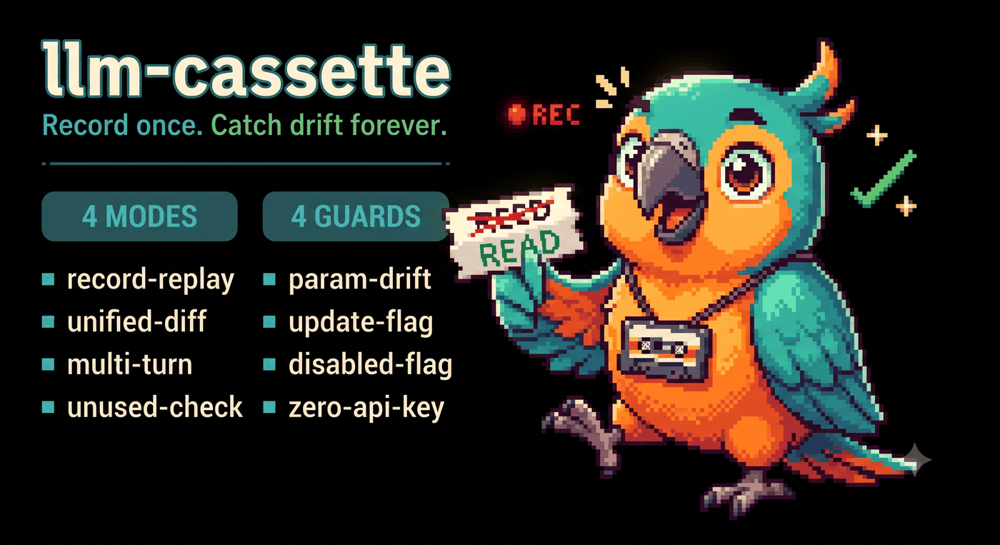
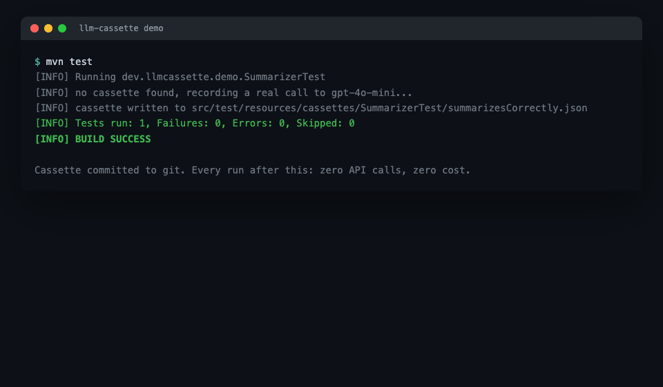
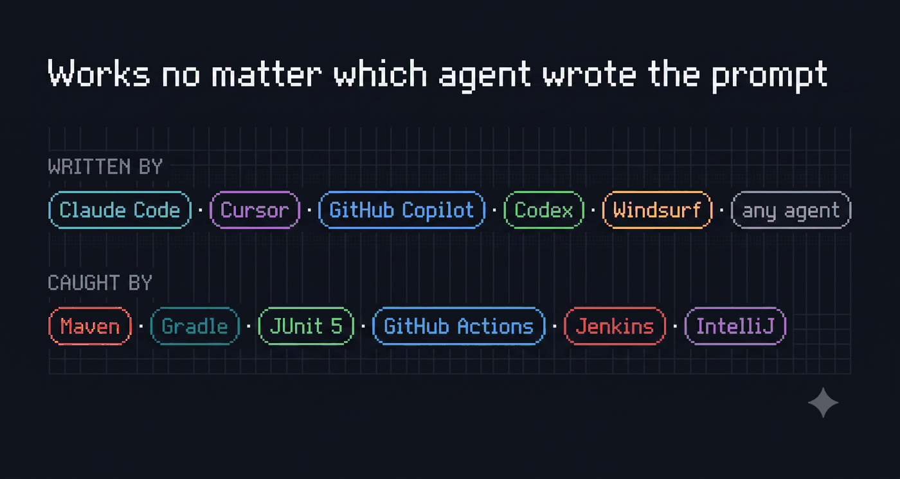
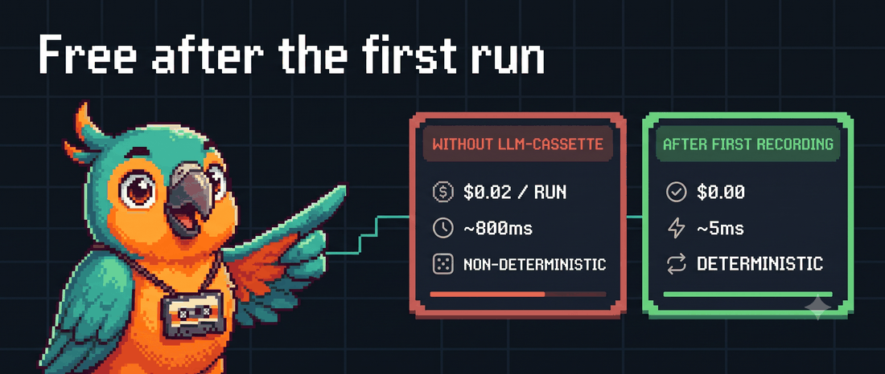

# llm-cassette

[](LICENSE)
[](pom.xml)
[](CONTRIBUTING.md)



Shipping AI features fast with an agent like Claude Code or Cursor means
prompts get edited constantly, often buried inside a larger diff nobody
reads line-by-line. `llm-cassette` is a JUnit5 extension that catches
exactly that: it records real LangChain4j `ChatModel` calls once, replays
them without an API key from then on, and **fails your existing CI
pipeline** the moment the outgoing request stops matching what was
recorded — the same `mvn test` / `gradle test` step you already run,
no new pipeline to wire up.

Verified end-to-end against a real, separate consumer project (not just
this repo's own test suite): both Maven (Surefire) and Gradle correctly
report a non-zero exit code and preserve the full diff in their test
reports when a recorded interaction drifts.



## 30 seconds to your first caught regression

```java
@RegisterExtension
CassetteExtension cassette = new CassetteExtension(realChatModel);

@Test
void summarizesCorrectly() {
    ChatModel model = cassette.model();   // first run: calls the real model and records
    String result = mySummarizer.summarize(model, "...");  // every run after: replays, no API key needed
    assertEquals("expected summary", result);
}
```

First run: hits your real model once, writes `src/test/resources/cassettes/<TestClass>/<testMethod>.json`.
Every run after: replays from that file — fast, free, deterministic — and
throws a diff like the one above if the request has drifted.

## Works in your existing CI, no new pipeline



Add it as a normal test dependency — GitHub Actions, Jenkins, whatever
already runs your test step picks this up automatically:

**Maven**

```xml
<dependency>
    <groupId>dev.llmcassette</groupId>
    <artifactId>llm-cassette</artifactId>
    <version>0.1.0-SNAPSHOT</version>
</dependency>
```

**Gradle**

```groovy
testImplementation 'dev.llmcassette:llm-cassette:0.1.0-SNAPSHOT'
testRuntimeOnly 'org.junit.platform:junit-platform-launcher' // Gradle needs this explicitly
```

That second Gradle line isn't an llm-cassette quirk — recent Gradle
versions need `junit-platform-launcher` on the test runtime classpath
explicitly, or `gradle test` fails before it even reaches your tests.

## What you get

- **Record once, replay forever.** No API key needed in CI after the first
  recording. Commit the cassette file to git.
- **A real diff, not a plain assertion failure.** The mismatch error is an
  `org.opentest4j.AssertionFailedError` with `expected`/`actual` set, so
  IntelliJ (and other JUnit5-aware IDEs) render a clickable side-by-side
  diff automatically — no custom UI needed.
- **Multi-turn support.** A test that calls the model more than once (a
  multi-step agent, a simulated conversation) gets each call matched against
  the recorded interaction in order.
- **Catches parameter drift too**, not just prompt text — a silent
  `temperature` or `modelName` change counts as drift.
- **Unused-interaction detection.** If your code now calls the model *fewer*
  times than what's recorded, that's also flagged — the cassette isn't just
  an upper bound on requests, it's an exact expectation.
- **Explicit escape hatches**, not implicit magic:
  - `-Dcassette.update=true` re-records intentional changes (same idea as
    Jest's snapshot update flow).
  - `-Dcassette.disabled=true` always calls the real model, bypassing
    cassettes entirely — for the occasional nightly integration run.
- **Zero server, zero DB.** Cassettes are plain JSON files next to your tests.



## How it works

`ChatModel` funnels every call shape (`chat(String)`, `chat(ChatMessage...)`,
etc.) through one low-level hook, `doChat(ChatRequest)`. `CassetteChatModel`
is a `ChatModel` decorator that intercepts just that hook:

- **No cassette file yet** → calls your real model, records the request
  (model name, temperature, message text) and the response text.
- **Cassette file exists** → compares the outgoing request against the next
  recorded interaction (trimming whitespace so pure formatting edits don't
  count as drift). Matches: replays the stored response, no real call made.
  Doesn't match: throws, with a diff.

`CassetteExtension` is the JUnit5 glue: it derives the cassette file path
from the test class and method name, and checks after each test that every
recorded interaction was actually used.

## Limitations

- v1 only supports plain-text `SystemMessage`/`UserMessage`/`AiMessage`.
  Multimodal content (images) and tool-execution messages aren't handled yet
  (`ChatMessages` throws a clear error if you hit one).
- Only the synchronous `ChatModel.doChat` path is covered. Streaming/async
  (`doChatAsync`, `StreamingChatModel`) is a separate feature surface, not
  in v1 — see CONTRIBUTING.md.
- Only `modelName` and `temperature` are tracked from `ChatRequestParameters`.
  Other parameters (topP, maxOutputTokens, stop sequences, ...) aren't
  compared yet.

## Build and test

```
mvn test
```

## Contributing

See [CONTRIBUTING.md](CONTRIBUTING.md) for real, unclaimed extension points.

## License

[MIT](LICENSE)
